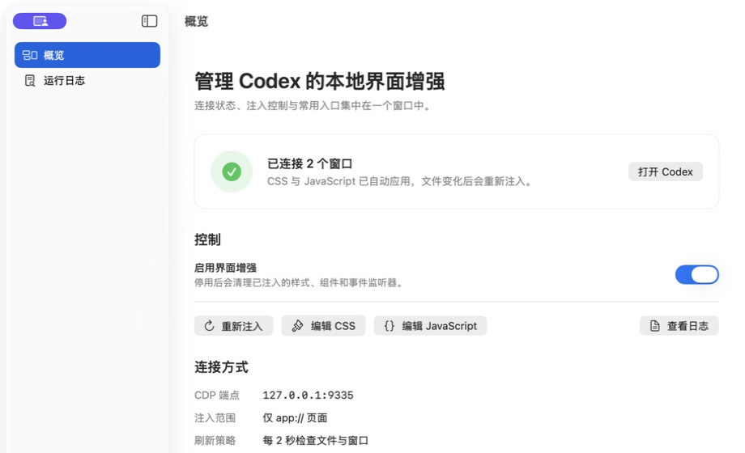
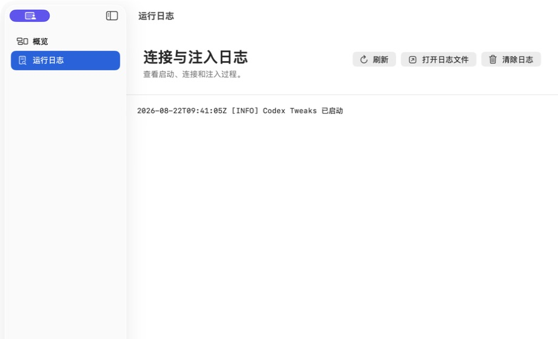

<p align="center">
  
</p>

<h1 align="center">Codex Tweaks</h1>

<p align="center">
  用一个原生 macOS App，管理 Codex 桌面客户端的本地 CSS、JavaScript 模块与第三方浏览器库。
</p>

<p align="center">
  
  
  
  
  
  <a href="https://github.com/cr-zhichen/codex-tweaks/actions/workflows/ci.yml"></a>
  <a href="https://github.com/cr-zhichen/codex-tweaks/releases"></a>
</p>

## 简介

Codex Tweaks 是一个带主窗口与菜单栏入口的原生 macOS 工具。它通过仅监听本机的 Chrome DevTools Protocol（CDP），把用户自己的 CSS 和 JavaScript 注入 Codex 的 `app://` 页面，并在文件变化、页面刷新或新窗口出现后自动恢复。

项目不会修改 `ChatGPT.app` 或 `app.asar`，也不需要常驻的 Node.js CLI。所有自定义资源都保存在用户目录中，可以直接检查、编辑、停用或删除。

> Codex Tweaks 是非官方本地定制工具。Codex 客户端升级后，页面结构或调试参数可能发生变化。

## 功能

| 模块 | 功能 |
| --- | --- |
| Codex 连接 | Codex 未运行时使用本机 CDP 参数启动；已运行但未开启 CDP 时提示确认重启；用户主动退出后不会反复拉起 |
| 自动注入 | 发现全部 `app://` 页面并幂等注入 CSS/JavaScript；每 2 秒检查窗口与资源变化 |
| 模块化定制 | 按固定顺序递归加载 `vendor`、入口文件与功能模块；每个 JavaScript 文件使用独立作用域 |
| 第三方库 | 支持本地固定版本的 IIFE/UMD 浏览器 bundle，并通过库注册表在功能模块间显式共享 |
| AI 编写提示词 | 一键复制包含当前路径、模块契约、第三方库规则、生命周期和验证要求的提示词，交给 Codex 或其他智能体执行 |
| 本地编辑 | 从概览页直接编辑入口 CSS/JavaScript，或在 Finder 中管理全部模块；保存后自动重新注入 |
| 原生界面 | SwiftUI 主窗口集中显示连接状态、注入控制、资源入口、运行日志和软件更新；菜单栏保留常用快捷操作 |
| 日志 | 最新记录优先显示，支持刷新、打开日志文件，以及确认后清除现有日志 |
| 软件更新 | 启动或手动检查 GitHub Releases；支持正式版/测试版通道、跳过版本，以及自动选择 arm64、x86_64 或 universal DMG |
| 生命周期 | 停用增强或正常退出时清理样式、Shadow DOM 和已注册的事件监听器 |
| 默认示例 | Codex 页面右下角显示隔离在 Shadow DOM 中的 `CT` 按钮；模型选择器作为独立模块使用 Pretext 计算菜单宽度 |

## 界面预览

| 连接概览 | 运行日志 |
| --- | --- |
|  |  |

## 工作方式

```text
Codex Tweaks.app
  ├─ 启动或连接 ChatGPT.app
  ├─ GET 127.0.0.1:9335/json/list
  ├─ 筛选 type=page 且 URL 为 app:// 的目标
  ├─ WebSocket → Runtime.evaluate
  └─ 按顺序注入 vendor + ui 入口 + scripts/styles 模块
```

注入脚本使用内容指纹判断资源是否变化，并在独立的 Shadow DOM 中承载默认组件。重复检查不会重复创建节点；重新注入前会先执行上一版本注册的清理回调。

## 开始使用

### 安装发行版

从 [GitHub Releases](https://github.com/cr-zhichen/codex-tweaks/releases) 下载适合当前 Mac 的 DMG：

- `Codex-Tweaks-vX.Y.Z.dmg`：universal，同时支持 Apple 芯片和 Intel Mac
- `Codex-Tweaks-vX.Y.Z-arm64.dmg`：仅支持 Apple 芯片
- `Codex-Tweaks-vX.Y.Z-x86_64.dmg`：仅支持 Intel Mac

打开 DMG 后，将 Codex Tweaks 图标拖移到“应用程序”文件夹即可安装。发行版采用 ad-hoc 签名且未经过 Apple 公证。若 macOS 阻止首次打开，请在“系统设置 → 隐私与安全性”中确认打开。下载后可以使用同一 Release 中的 `SHA256SUMS` 校验文件完整性。

应用默认在启动时检查更新，也可以从“关于与更新”或菜单栏手动检查。正式版通道只接收稳定版本；测试版通道接收稳定版、Beta 与 RC，但不会接收 Alpha 或其他预发布类型。发现新版本后可以立即下载、稍后提醒，或跳过当前版本。

### 环境要求

- macOS 13 或更新版本
- Xcode
- [mise](https://mise.jdx.dev/)
- 已安装包含 Codex 桌面客户端的 `ChatGPT.app`

### 构建与启动

```sh
mise install
mise run build
open "dist/Codex Tweaks.app"
```

首次连接时：

1. Codex 未运行：Codex Tweaks 会使用仅监听 `127.0.0.1:9335` 的调试参数启动客户端。
2. Codex 已运行且 CDP 可用：直接连接并注入当前全部 `app://` 窗口。
3. Codex 已运行但没有 CDP：界面会说明原因，并在用户确认后重新启动 Codex。

## 自定义 CSS 与 JavaScript

首次启动会创建下面的资源结构，旧版的 `ui.css` 与 `ui.js` 入口仍然兼容：

```text
~/Library/Application Support/Codex Tweaks/Tweaks/
├── vendor/   # 第三方浏览器 bundle，最先加载
├── ui.css    # CSS 入口
├── styles/   # 功能样式
├── ui.js     # JavaScript 入口
└── scripts/  # 功能脚本
```

在“概览”中点击“编辑入口 CSS”或“编辑入口 JS”可用系统关联的外部编辑器打开入口文件；点击“在 Finder 中管理模块与第三方库”可以管理完整目录。保存、增加、删除或重命名任意 `.css` / `.js` 文件后无需重启应用，下一轮检查会根据文件路径与内容指纹自动重新注入。

加载顺序固定为：

1. CSS：`vendor/**/*.css` → `ui.css` → `styles/**/*.css`
2. JavaScript：`vendor/**/*.js` → `ui.js` → `scripts/**/*.js`

每个目录内部按相对路径升序递归加载，因此推荐用 `10-`、`20-` 这样的文件名前缀表达依赖顺序。隐藏文件和扩展名不匹配的文件不会加载。每个 JavaScript 文件都在自己的函数作用域中运行，一个模块里的 `const`、`let`、`var` 或函数声明不会污染其他模块；模块异常会带上对应的相对文件名。

每个 JavaScript 模块都会获得：

- `root`：隔离的 `ShadowRoot`
- `api.version`：当前资源版本
- `api.registerLibrary(name, value)`：注册一个跨模块共享的库；同名重复注册会报错
- `api.hasLibrary(name)`：判断库是否已经注册
- `api.getLibrary(name)`：取得已注册的库；缺失时会报错
- `api.listLibraries()`：列出当前注册的库名
- `api.registerCleanup(callback)`：注册重新注入或停用时的清理逻辑

### 引入第三方库

Codex 页面的内容安全策略会阻止常见的远程或 `data:` 动态模块导入，因此 Codex Tweaks 不绕过 CSP，也不直接执行 CDN URL。稳定的方式是把依赖固定为经过审阅的浏览器 bundle：

1. 将库打包为单文件 IIFE/UMD，并保留版本与许可证，例如 `vendor/10-some-lib.js`。
2. 如果库暴露为 `globalThis.SomeLib`，在随后加载的 `vendor/11-some-lib-adapter.js` 中注册并移除临时全局变量：

   ```js
   api.registerLibrary("some-lib", globalThis.SomeLib);
   delete globalThis.SomeLib;
   ```

3. 在功能模块（例如 `scripts/20-my-feature.js`）中显式取得：

   ```js
   const SomeLib = api.getLibrary("some-lib");
   ```

第三方样式可以直接放入 `vendor` 下的 `.css` 文件。如果 npm 包只提供 ESM/CJS，需要先用 bundler 转成面向浏览器的单文件 IIFE/UMD；模块文件本身不支持静态 `import` / `export`。默认资源中的 `@chenglou/pretext` 就使用这套注册表提供给模型选择器。

### 交给 AI 编写

概览页和菜单栏都提供“复制 AI 编写提示词”。复制内容会自动带上当前 Tweaks 目录，并明确模块加载顺序、JavaScript 生命周期、第三方库、样式与验证规则。

粘贴给 Codex 或其他智能体后，只需把末尾“我的具体需求”占位内容替换为实际需求。

## 安全边界

- CDP 固定监听 `127.0.0.1:9335`，不会主动暴露到局域网。
- 调试端口开启期间，本机其他进程仍可能连接；不要把该端口转发或代理到外部网络。
- 退出 Codex Tweaks 会清理当前注入内容，但不会关闭 Codex 已开启的调试端口；完全退出并正常重开 Codex 后才会关闭。
- 自定义 JavaScript 与 Codex 页面拥有相同的渲染上下文权限，只运行自己审阅过的本地脚本和第三方 bundle，并固定依赖版本、保留许可证。
- 目标筛选刻意排除普通 `https://` 页面，不会向 Codex 的应用内浏览器网页注入。

## 开发

项目使用 XcodeGen 生成工程，相关工具版本与任务由 `mise.toml` 统一管理。

```sh
mise run generate   # 生成 CodexTweaks.xcodeproj
mise run test       # 运行 macOS 单元测试
mise run build      # 构建 Release App 到 dist/
mise run launch     # 启动已构建的 App
mise run workflows:lint # 检查 GitHub Actions 与 Release 脚本
mise run verify     # 工作流检查、测试、Release 构建与差异检查
mise run kill       # 停止 Codex Tweaks
mise run clean      # 清理 build/ 与 dist/
```

Release 构建输出：

```text
dist/Codex Tweaks.app
```

## CI/CD

GitHub Actions 使用 macOS 26 runner，并通过 `jdx/mise-action` 安装 `mise.toml` 中固定的 XcodeGen、actionlint 与 ShellCheck：

- `CI`：在 `main`、Pull Request 和手动触发时运行 `mise run verify`，并保留 14 天的 arm64 App 构建产物。
- `Release`：推送 `v*` 标签后运行测试，构建并校验 universal、arm64、x86_64 三套 DMG，随后发布到 GitHub Releases。
- 带连字符的标签（例如 `v0.1.0-beta.1`）会成为 Prerelease；普通标签（例如 `v0.1.0`）会成为稳定版本。
- 重跑同一标签时会更新构建产物，但不会重复追加自动生成的 Release Notes。

发布新版本：

```sh
git tag -a v0.1.0 -m "v0.1.0"
git push origin v0.1.0
```

也可以在 GitHub Actions 中手动运行 `Release`，并填写一个已经存在的 `v*` 标签。发布脚本同样可以在本机运行：

```sh
RELEASE_TAG=v0.1.0 BUILD_NUMBER=1 mise run release
```

## 验证范围

自动测试覆盖 CDP 目标筛选、注入脚本生成、清理逻辑、内容指纹，以及完整 SemVer 排序、更新通道筛选、GitHub 请求、跳过状态与 DMG 架构选择。`mise run verify` 会检查 GitHub Actions、执行测试与 Release 构建，并确认 XcodeGen 没有产生未提交的工程差异；本地构建成功不代表所有未来 Codex 客户端版本都保持相同页面结构。

当前实现仅对 `app://` 页面生效。真实注入仍取决于 Codex 客户端允许的 CDP 启动参数、端口状态以及页面生命周期。

## 项目结构

```text
app/
├── Sources/                    # SwiftUI、启动器、CDP 与注入实现
├── Resources/Assets.xcassets/  # macOS AppIcon 资产目录
├── Resources/Branding/         # B1 原始图标母版
├── Resources/Tweaks/           # 默认入口、第三方 vendor 与功能模块
└── Tests/                      # 目标筛选、脚本生成与内容指纹测试
docs/                           # README 界面截图
.github/workflows/              # CI 与标签发布工作流
scripts/                        # Release 打包与产物校验脚本
mise.toml                       # 固定依赖与统一任务入口
project.yml                     # XcodeGen 工程定义
```
